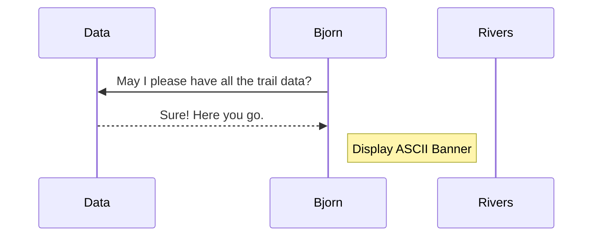

## Practice and Review




```mermaid
sequenceDiagram
    participant Adventure
    participant data
    participant functions


note over data:create array of objects
note over data:export trails & rivers to functions and Adventure modules
functions<-data: import data in array
Adventure<-data: import data in array
note over functions:import trails & rivers
note over Adventure:import trails & rivers
note over Adventure:import functions
functions -->Adventure : here are the function instructions
note over functions:get sum of all trails
note over functions:get shortest trails
note over functions:get longest trail
functions -->Adventure : here is sum, shortest and longest trail functions
note over Adventure:log & invoke trail total
note over Adventure:log & invoke shortest trail
note over Adventure:log & invoke longest trail
functions -->Adventure : here are the function instructions
note over functions:get shortest river
note over functions:get longest river
functions -->Adventure : import the longest, shortest rivers function instructions
note over Adventure:log & invoke river total
note over Adventure:log & invoke shortest river
note over Adventure:log & invoke longest river

note over functions:get cheap and pricey trails
functions -->Adventure : import cheap and pricey trails 
note over Adventure:log & invoke cheap trail
note over Adventure:log & invoke expensive  trail

note over functions:get cheapest and pricey rivers
functions -->Adventure : import cheap and pricey rivers 
note over Adventure:log & invoke cheap river tour
note over Adventure:log & invoke pricey river tour


note over Adventure:loop through trails
note over Adventure:loop through rivers
note over Adventure:log & invoke details
```